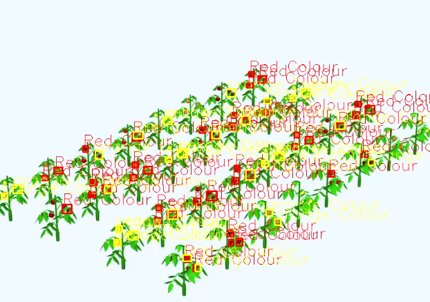
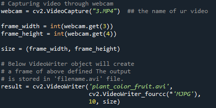
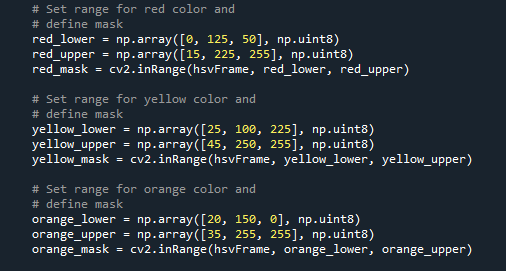
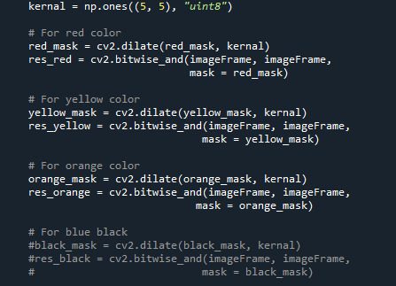
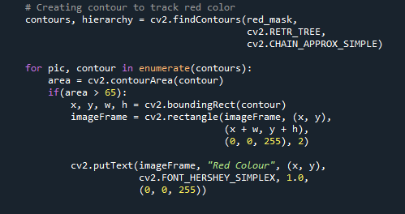
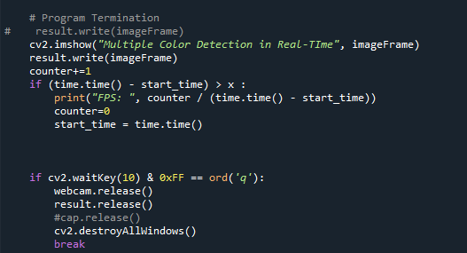

# Fruit-color-detection
this project will detect the color of fruit 

it just detect orange, yellow and red color

dataset : https://drive.google.com/file/d/1bq5W71Nc8ODM0OZ5oKrjB_8Xq7T12PXF/view?usp=sharing

# Open-CV for Color Detection 

This is an implementation of Open-CV on Python 3. This code generates bounding boxes and detecting color of an object in the image. It's based on lower RGB and Upper RGB.

The repository includes:
* Source code of Fruit Color Detection using Open-CV .
* Jupyter notebook to visualize the detection of pipeline at every step
* Example of training on your own dataset

# Getting Started
* open colour detection.py in the main page  Is the easiest way to start. It shows an example of using an Open-CV to Detect Color in your own videos.

# Step by Step Detection

## 1. Input video or webcam 
just input the video what u want to detect or webcam in realtime.

## 2. Define Color and range the uppercolor and lowercolor
This example will define uppercolor and lowercolor red, yellow and orange color.

## 3. Make color kernel
this step will make the color kernel.

## 4.Creating contour to track ur color 
we need to creat contour to track ur color and make it to rectangle 

## 5.Execute program
this step gonna execute this program show it in real-time and save it 

